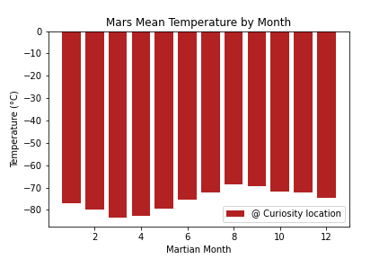
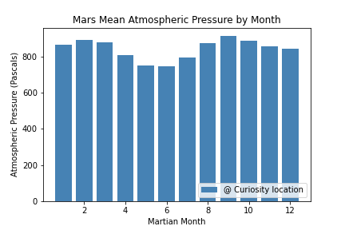
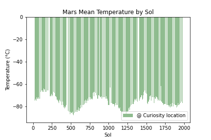

# Mission to Mars - Web Scraping with HTML/CSS

## Analysis Q&A

1. How many months exist on Mars? **12**
2. Which month, on average, has the lowest temperature? The highest? **Lowest Temperature = Month 3, Highest Temperature = Month 8**
    

        
    
 

3. Which month, on average, has the lowest atmospheric pressure? The highest? **Lowest Atmospheric Pressure = Month 6, Highest Atmospheric Pressure = Month 9**
    

        
    
 

4. How many terrestrial days exist in a Martian year? **~680; based on repeatability of temperature trends**
    

        
    

Here's the [link](mars_temp_data.csv) to the dataset.